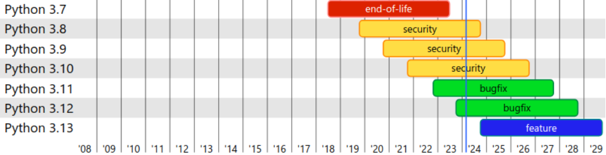

# 前言

## 安装(最好在课前操作，有问题问助教)

一句话建议： 安装 conda 系工具管理环境(装好就自带 Python 了)，conda 里配外围的非 Python 包，再用 pip 装纯 python 包

<br/>

决策因素：操作系统、环境管理、与其他语言的联用情况

- Windows 用户需要额外选择宿主系统：
  - Windows 下安装: 用户体验熟悉，方便; 
  - [WSL](https://learn.microsoft.com/zh-cn/windows/wsl/install) 下安装: 更贴近服务器，更高效率，更好检索报错(趁着刚开学有空，折腾一下)

- 环境管理：
  - [Anaconda](https://mirrors.tuna.tsinghua.edu.cn/anaconda/archive/?C=M&O=D), [miniconda](https://mirrors.tuna.tsinghua.edu.cn/anaconda/miniconda/?C=M&O=D), mamba: 管理 Python 和其他依赖版本 (附带 Python 解释器)
  - 更小更轻量: virtualenv, poetry, uv, 更一般化: docker


<br/>
<center>
 [.sh 文件是什么，如何运行](https://chatglm.cn/fx/emmKbBbQob)
</center>

---

## 安装 - Python 版本选择

```bash
conda create -n <环境名> python=<版本号> # 创建指定名字和 Python 版本的环境
conda activate <环境名>                 # 切换环境
python --version                        
```



学习时建议选择 3.10/3.11，复现项目/二次开发跟随项目

</br>

一种约定 - [语义版本号](https://semver.org/lang/zh-CN/)：(大部分软件/包都依照此惯例命名)

<center>
主版本.次版本.修订
<center/>

## 安装 - IDE 选择

1. [VSCode](https://code.visualstudio.com/) （推荐）:
    - 文本编辑器 + 丰富插件，需要配置
    - 远程开发体验好
2. [PyCharm](https://www.jetbrains.com/pycharm/) （推荐）: 
    - 功能全面开箱即用，但较大
    - 远程开发需要专业版才有较好的体验(教育邮箱免费)
3. [Spyder](https://www.spyder-ide.org/):
    - Anaconda 自带，界面类 MatLab
    - 远程开发需要手动配置本地 + 远程
4. [Jupyter 系 WebIDE](https://jupyter.org/):
    - Anaconda 自带，从 JupyterNoteBook 衍生，基于网页，注重交互
    - 功能已被上三个 IDE 部分吸收
   

## 课程定位

:::::::::::::: {.columns}
::: {.column width="70%"}

先修要求里有程序设计，通常来说是本系的 C 和 C++

我系代代相传的话：“一年级后的课程不会再教语言了”

~~本课程需要用到 Python, 常用的库有 numpy, matplotlib, sklearn, pandas, torch, 请根据作业要求自行学习，下课~~

:::
::: {.column width="30%"}
<figure>

</figure>

:::
::::::::::::::

<br/>

:::::::::::::: {.columns}
::: {.column width="70%"}
但这确实是一节导学性质的课程

课上不会再教你什么是条件判断、循环、类...

而会教你，迁移已有的编程经验来快速上手 Python

**如何搜教程、读文档、抓重点** - 以 Python 速成为例

**目标效果**：写作业不会卡壳在不知道怎么用代码做实现（~~推不出算法和公式还是有可能的~~）

:::
::: {.column width="30%"}

<figure>

<figcaption aria-hidden="true">
    <a href="https://chatglm.cn/fx/kckpa0rHHT">如何在C语言基础上学 Python </a>
</figcaption>
</figure>

:::
::::::::::::::


# Python 基础语法

## 基本语句

从[官方教程](https://docs.python.org/3/tutorial/index.html)中带着问题，有目的地摘取跳读

如：Python 程序怎么跑？怎么实现面向过程式编程？面向对象式编程？它的优势是？

更速成的问题导向：要用做一个对摄像头目标检测的项目，怎么实现/魔改？

- Python 程序的运行
```bash
python <path_to_.py_file> # 运行指定的 python 脚本
```

- 变量、赋值、基本数据类型
```python
a_variable = "Hello World!"  # 字符串类型的变量 
print(a_variable)
a_variable = 1  # 变量无需类别声明和保持类型，可直接赋值为整型
a_varilabe += 3
print(a_variable)
```

## 控制流

:::::::::::::: {.columns}

::: {.column width="50%"}
- 条件语句
```python
if <条件1>:
    <语句块1>
elif <条件2>: # 可选
    <语句块2>
...
else:        # 可选
    <语句块n + 1>
```

``` python
age = int(input("input your age: "))
if age >= 18:
    print("adult")
elif age >= 6:
    print("teenager")
else:
    print("kid")
```
:::

::: {.column width="50%"}
- 循环语句

``` python
while <循环条件>:
    <循环体>  # 可用 continue, break
```

``` python
i = 1
while i < 10:
    i *= 2
print(i)  # 16
```

``` python
    for <变量名> in <可迭代对象>:
        <循环体>
```

``` python
for char in "Hello World":
    print(char)  # 逐字符打印
```

:::

::::::::::::::

## 函数

包装一个常用的过程

```python
def <函数名>(参数名1, 参数名2..):
    <函数实现>
```

```python
def parse_csv_string(content):
    content_by_lines = content.split('\n')
    result = []
    for line in content_by_lines:
        result.append(line.split(','))
    return result
```

<br/>

- 延伸1：[type hint](#code-style)
- 延伸2：[functional programming](#functional-programming)

## 类

```python
class Complex:
    def __init__(self, realpart, imagpart):  # 构造函数
        self.r = realpart
        self.i = imagpart

    def to_string(self):  # 自定义的对象方法
        return f'{self.r} + {self.i}i'

    def __mul__(self, complex_b):  # 重载 * 运算符
        return Complex(
            self.r * complex_b.r - self.i * complex_b.i,
            self.i * complex_b.r + self.r * complex_b.i
        )
a, b = Complex(1,2), Complex(3,4)
print(a.to_string(), b.to_string(), (a * b).to_string())
```

继承、多态、类变量、类方法等等， Python 也有，见[官方文档](https://docs.python.org/3/tutorial/classes.html#)。延伸：[设计模式](#from-oop-to-design-pattern)

## 其他常用内建对象

- 列表
``` python
a_list = [1, 2, 'str']  # 列表，类似 数组 / vector 但无类型限制

for item in a_list:
    print(item)   # 1, 2, str 顺着出
print(a_list[0])  # 1
```

- 字典
  
```python
a_dict = {"str_key": "value", 1: 2}  # 哈希表，类似 map，同样无类型限制

print(a_dict["str_key"])  # value
print(a_dict[1])          # 2
```

## 多文件工程 - 模块与导入

```
import <module_name>  # 导入其他的 .py 脚本/包(统称模块), 类似 #include
# 其他方法
import <module> as <module_name>  # 导入模块并重命名
from <module> import <varialbe_name> # 导入模块中感兴趣的变量到当前空间
```

<br/>

import 后发生的事：

1. 按 当前路径 -> Python 解释器库路径，按名字查找模块
2. 找到后，运行模块
3. 将运行模块后得到的，所有具名变量、函数、类，放到模块下的命名空间

```python
import math         # 可以在这里打断点，检查一下是不是上面描述的那样执行
print(math.exp(2))  # 7.38905609893065
```

## 多文件工程 - 自定义模块

```
.
├── package
│   ├── __init__.py  # 让文件夹变成模块，import 时执行这里的语句
│   └── sub_file.py
├── file_module.py
└── main.py
```


:::::::::::::: {.columns}

::: {.column width="33%"}
```python
# main.py
import file_module
import package
print(file_module.var)
print(package.var)
```
:::

::: {.column width="29%"}

```python
# file_module.py
print("print in f")
var = "file_module"
```

:::

::: {.column width="38%"}

```python
# package/__init__.py
from .sub_file import var
# package/sub_file.py
print("print in sf")
var = "sub_file"
```

:::

:::::::::::::

<center>
运行 `main.py` 以上会打印出几行字，分别在何时打印？
</center>

扩展：[模块划分与单元测试](#codestyle---模块划分)

# 常用的 Python 第三方库

## 安装库

```bash
pip install <包名> [-i <镜像站点名>] # 加速；在仅有内网的服务器上装环境
python -m pip install <包名> [-i <镜像站点名>] # 一种等价形式
```

<br/>

扩展：

1. `python -m` 是什么？
2. 这两种方法是如何等价的(很多 Python 包也是这两种启动方式都有)？ 
3. `pip` 是一个 Python 写的程序，它装包时的大致流程/主要调用的函数是？

## NumPy

[NumPy](https://numpy.org/doc/stable/index.html): 多维数组、矩阵等数学对象工具包

- 数组创建，逐元素数学运算

```python
import numpy as np
a = np.array([
    [-1,2,0,9],
    [-2,8,0,4]
])

a.shape # (2, 4)
np.max(a) # 9
# 数组对象.运算方法; 前后次序清晰地链式调用对象方法: 对象.运算1().运算2()...
a.max(9)  # 9
a.max(axis=1)  # array([9, 8])
a.abs()  # 逐元素取绝对值
a.sin()  # 逐元素取 sin
a + 1.5 * a # 逐个元素乘和加
```

## Numpy - 矩阵运算

```python
import numpy as np
a = np.array([
    [-1,2,0,9],
    [-2,8,0,4]
])
b = 2 * a
c = b.T

np.matmul(a, c)  # 矩阵乘法
a @ c            # 矩阵乘法另一种写法，通过定义什么 __xx__ 实现？
# np.matmul(a,b), a @ b # 自然这两种调用都会报错
np.linalg.inv(a @ c) # 矩阵求逆
np.linalg.svd(a)   # svd 分解，查查文档 U Sigma V 三个矩阵具体返回成什么形式？
```

## Numpy - 随机

```python
import numpy as np
# np.random.seed(123) # 设置随机种子，让多次运行脚本发生的随机数都一致
np.random.rand(2, 4)  # 在 [0, 1] 均匀分布上独立抽出 2*4个数组成矩阵
np.random.randn(2, 4) # 在 0 均值 1 方差的高斯分布上独立抽出 2*4个数组成矩阵
np.random.binomial(5, 0.3, size=(2,4)) # 在 (n,p)=(5, 0.3) 的二项 ... 2*4个数
```

扩展：

- NumPy 到底因何而快？
  - 对比一下手写的纯 Python 实现的矩阵乘法/FFT 的运行速度
  - 了解 Python GIL 和 Python C extension

## Matplotlib

[Matplotlib](https://matplotlib.org/stable/users/index.html): 一个绘图库

```python
import numpy as np
import matplotlib.pyplot as plt
x = np.linspace(-5, 5, 100)
y = np.sin(x)

plt.plot(x, y, color='blue') # 指定作图数据，图线颜色
plt.xlabel("x")              # x 轴命名
plt.ylabel("y")              # y 轴命名
plt.title("sin function")    # 全图标题 
# plt.show()                 # 在窗口中显示
plt.savefig("sin_func.png")  # 保存为图片
```

- 补充资源：[cheatsheet](https://matplotlib.org/cheatsheets/)，作图库适合这样边看视觉效果边调整的方式来使用
- 扩展：以上为仿照 MATLAB 风格的作图代码。但 MATLAB 在语言设计上并不好，[Matplotlib 官方Style Guide](https://matplotlib.org/stable/users/explain/quick_start.html#coding-styles)推荐更 OOP 更显式地指定图、轴来作图

## sklearn

[scikit-learn](https://scikit-learn.org/stable/user_guide.html): 一个机器学习工具包

```python
# 用模拟数据拟合一个线性回归模型
import numpy as np
from sklearn.linear_model import LinearRegression
x = np.random.randn(110, 1) * 5
y = 2 * x + 1 + np.random.randn(*x.shape)
x_train, x_test = x[:100, ...], x[100:,...]
y_train, y_test = y[:100, ...], y[100:,...]

model = LinearRegression()
model.fit(x_train, y_train)         # 用训练数据拟合模型
y_pred = model.predict(x_test)      # 用(拟合好的)模型进行预测
mse_test = ((y_test - y_pred) ** 2).mean()
print(f"{model.coef_=}, {model.intercept_=}, {mse_test=}") # 参数，测试集MSE
```

扩展: sklearn 的接口设计都很统一，换一个 [Lasso 回归模型](https://scikit-learn.org/stable/modules/generated/sklearn.linear_model.Lasso.html#sklearn.linear_model.Lasso) 看看怎么用？

## Pandas, Pillow/Opencv 等用来读取和预处理数据的库

- [Pandas](https://pandas.pydata.org/pandas-docs/stable/index.html): 一个表格/关系型数据的综合包
- [Pillow](https://pillow.readthedocs.io/en/stable/): 一个 Python 图像包
- [opencv](https://docs.opencv.org/4.9.0/d6/d00/tutorial_py_root.html): 一个计算机视觉算法包

本课程主要中用包括但不限于以上的包，来读取相应的数据，并可能做一定的预处理

<br/>

例：pandas 读 `.csv` 文件，将得到的 `DataFrame` 对象取所需部分，变成 `numpy` 数组 

```
import pandas as pd
df_train = pd.read_csv("data.csv")
x = df_train["lcavol"].to_numpy()
y = df_train["lpsa"].to_numpy()
```

# 延拓

## Python 的生态

Python 很火，因为它使用者很多，Python 的使用者多，是因为它有丰富的第三方库和良好的生态，能帮你做到各种事。

举例，除了课程直接相关的 ML, DL 库，本课程还有这些地方用到了 Python 生态：

1. [Manim](https://github.com/manimCommunity/manim): 一个动画库，后续课件中的一些解释动画用了它
2. [Scrapy](https://github.com/scrapy/scrapy): 某年大作业用它爬取了数据集
3. [Flask](https://github.com/pallets/flask): 自建大作业评测网站的年份用它来建站
4. [PyQt](https://www.riverbankcomputing.com/software/pyqt/intro): 某年大作业需要有小样本任务，需要标注，用它来写了个标注工具
5. [Executablebooks](https://github.com/executablebooks): 将来可能用此项目的一系列库，来做强交互能力的授课素材

<br/>
尝试从使用生态到贡献生态：

- 给开源项目做维护
- 我有一个好主意，[自己写一个 Python 包](https://packaging.python.org/en/latest/overview/)

## Code Style

好的编程风格能使代码更清晰，更容易 Debug 和维护。

大体上你可以参考 [Google Python style Guide](https://zh-google-styleguide.readthedocs.io/en/latest/google-python-styleguide/) 来学习代码风格。

有一些代码风格在 Python 社区里是比较通用的，如“类名用大写驼峰”，“函数名、变量名、模块名用小写下划线”，这有效的降低了维护者和使用者的心智负担。

`Type hint` 是值得额外拿出来说的一件事。Python 是一门动态类型语言，我们并不需要声明变量类型才能使用。但这也导致了： 1. 代码难以维护，过两天就不能通过只看代码知道这里是什么变量了 2. IDE 难提示，不知道变量类型，就不知道有什么方法能用


```python
# 自己写函数建议
def func(a: TypeOfA, ...) -> ReturnValueType:
    pass

# 如果调用了不做 TypeHint 的函数，在后面注释 # type: xxx
a = return_from_no_hint_func() # type: SomeClassOfA
# 这样 IDE 能知道变量类型，能做好提示，代码也更正式
```

## CodeStyle - 模块划分

工程量小的代码可以单文件，大的代码就需要恰当切分了。常见的 Python 项目的结构：

```
.
├── docs/...                   # 文档
├── [tests/...]                # 单元测试脚本
├── <package_name>             # 代码包 
│   ├── xxx.py ...             # 测试也可能一并写在模块脚本里
├── [examples/xxx.py ...]      # 展示包中代码用例
├── setup.py_or_pyproject.toml # 安装入口
└── README.md
```

作业不需要如此正式，但是单一入口原则和各模块测试是好的编程实践

``` python
# 主脚本.py -> import xxx , do somethine
# 模块脚本.py
def xxx / class XXX
if __name__ == '__main__':  # python 模块脚本.py 时满足条件，import 时不满足
    <测试以上函数/类的代码>
```

## From OOP to Design Pattern

[设计模式](https://en.wikipedia.org/wiki/Design_pattern) 是由 Alexander 等人提出的 (OO范式下)的软件设计原则，以提高代码的可维护和可重用性，原书是用 Java 作示例代码。当然这些原则其实应该是语言无关的，所以我们也会有 [Python 版本的设计模式](https://python-patterns.guide/)

当你尝试阅读和搭建大型工程的时候，你会经常见到他们的身影

比如 `sklearn` 的几乎所有模型，都使用了 Mixin 这一设计模式

以 [`LinearRegression`](https://github.com/scikit-learn/scikit-learn/blob/6bb2762b0b8c12b2e2578ef528ea7ea30580f9fa/sklearn/linear_model/_base.py#L434) 为例

```python
class LinearRegression(MultiOutputMixin, RegressorMixin, LinearModel):
    pass
```

这里继承的两个 Mixin 类来为 `LinearRegression` 添加功能，而这些功能独立而抽象，将它们抽出，可以少些很多代码，`Lasso`,... 也都能用

看看源码，它们到底是怎么提供便利的呢？实践一下，什么该打包抽象成一个 Mixin？

## Functional Programming

最纯粹的函数式编程是指：整个编程实践中只有一种类型“一元函数”，而且函数是“纯函数”：无副作用，什么时候给同样的输入，就得到同样的输出，没有中间状态(对象里的成员的值，屏幕上的输出都是程序状态)

演化自 [Lambda 运算](https://en.wikipedia.org/wiki/Lambda_calculus)。由于连“数”的类型都没有，原教旨的 FP 就需要学习怎么去构造数

<br/>

Python 里我们也用函数式编程，但主要是吸收它的精华：

1. 多写纯函数：没有中间状态，方便使用，方便测试，方便并行处理
2. 函数可以作为输入参数和返回值

本课程中涉及到一堆数学计算，多写纯函数的目标很容易达成

扩展例子 - [Jax](https://github.com/google/jax): Goolge 的新一代深度学习库，以 FP 为主打范式

## Functional Programming - Function as the input/output

``` python
def foo():        
    pass
print(type(foo))  # <class 'function'>
# def 某种程度上可以看成 foo = function() 创建了个对象并填代码
```

从 Python 的实现上来看，函数也是某种对象，所以它可以作为参数和返回值传递并不稀奇。

考虑一个在本课中很常见的情景：得到不同算法的运行时间和性能点，用于对比

```python
import time
start = time.time()  # 这段代码要写好多次，但有些微调整
pred = model.predict(x_test, ...) # 不同模型用的输入不一定相同
end = time.time()
evaluation = eval_metric_func(pred, y_test)
print(f"Time spent: {end - start}, performance: {evaluation}")
```

## Functional Programming - Function as the input/output

只加记录时间的功能

``` python
def time_record(func: Callable) -> None:
    def wrapper(*args, **kwargs):
        start = time.time()          # 这段代码要写好多次，但有些微调整
        pred = func(*args, **kwargs) # 不同模型用的输入不一定相同
        end = time.time()
        return pred, end - start
    return wrapper

model.predict = time_record(model.predict)  # 换了函数，把记时功能注入了
model.predict(x_test, ...)                  # 跟原来一样的调用方法
```

- `函数名 = 吃函数的函数(函数名)` 在 Python 中很常用，有语法糖 - [装饰器](https://python101.pythonlibrary.org/chapter25_decorators.html)
- 性能记录：用 `functools.partial` 固定参数 `y_test` ，得到只吃 `pred` 的函数并使用

## 杂项

其他你可能会高频见到的东西，试着根据术语和代码自主学习吧

``` python
# 上下文管理器
with open(file_path) as f:
    do_something()
```
```python
# 一些常用的 itertools, import itertools
for i in range(100):
for idx, (item_a, item_b) in enumerate(zip(list_a, list_b)):
for item_a, item_b in itertools.product(list_a, list_b):
```
```python
# 一些常用的 functools, import functools
network = reduce(lambda f, g: lambda x: f(g(x)), layers)
pred_result = map(network, data_list)
@functools.cache
def func_to_dump_input_output_to_cache:
    pass
```
